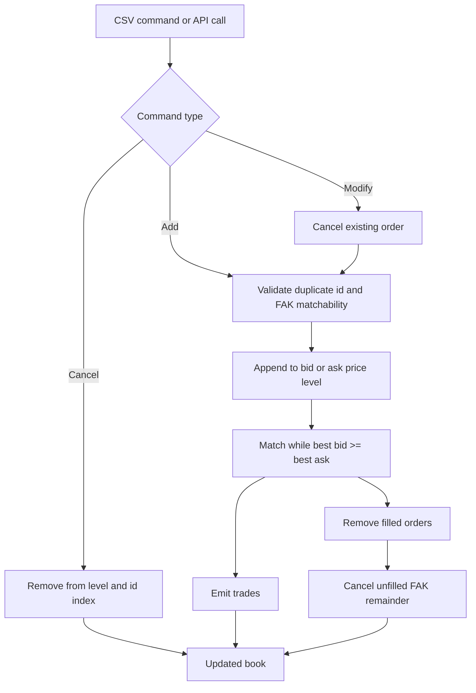

# Order Book Flow

```mermaid
flowchart TD
    A["CSV command or API call"] --> B{"Command type"}
    B -->|"Add"| C["Validate duplicate id and FAK matchability"]
    B -->|"Modify"| D["Cancel existing order"]
    B -->|"Cancel"| E["Remove from level and id index"]
    D --> C
    C --> F["Append to bid or ask price level"]
    F --> G["Match while best bid >= best ask"]
    G --> H["Emit trades"]
    G --> I["Remove filled orders"]
    I --> J["Cancel unfilled FAK remainder"]
    E --> K["Updated book"]
    H --> K
    J --> K
```

